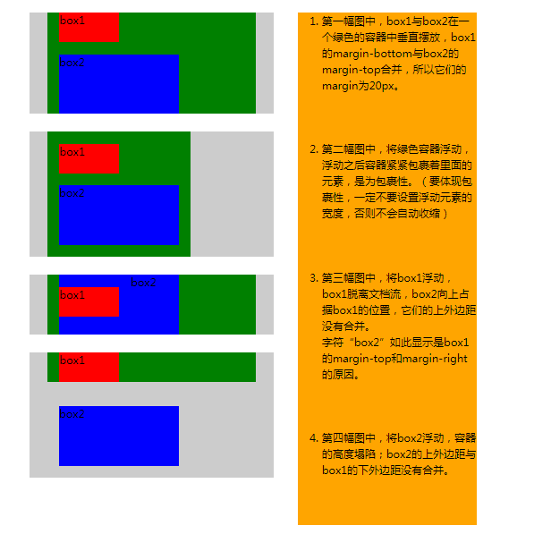

# CSS3 重要知识点汇总([CSS3新特性一览](http://www.cnblogs.com/star91/p/5659134.html))

[TOC]

---

## 1、盒模型 box-sizing属性

### 什么是盒模型？
盒模型是一种基础设计模式，定义了Web页面中的元素师如何看做盒子来解析的。

CSS中的每一个元素都是一个盒模型。网页设计中常听的属性名：content、padding、border、margin， CSS盒子模式都具备这些属性。这些属性我们可以用日常生活中的常见事物——盒子作一个比喻来理解，所以叫它盒子模式。

CSS盒子模型就是在网页设计中经常用到的CSS技术所使用的一种思维模型。

### box-sizing属性

Web前端设计师在制作布局效果时，常会因为给元素添加内距或边框二打破容器，破坏整个页面的布局。为了结局这个问题，CSS3添加了一个盒模型属性box-sizing，能够实现定义盒模型的解析方式，有content-box，border-box，inherit属性值。inherit：此值使用元素继承父元素的盒模型模式。

box-sizing属性主要用来控制元素的盒模型的解析模式，主要目的是控制元素的总宽度。有content-box和border-box属性值，content-box属性值内盒尺寸为：元素width/height=内容宽度/高度+padding+border+margin **内盒尺寸会发生变化** ；border-box内盒尺寸为：元素width/height=内容宽度/高度（包含了border和padding）**内盒尺寸不会发生变化** 。


**在自适应布局当中，在元素基础上添加内距padding，按照标准盒模型解析，往往会将布局撑破，但使用box-sizing的border-box值，就不会打破布局**。

---

## 2、解释一下CSS3的flexbox，以及适用场景（[详细](https://www.cnblogs.com/sxz2008/p/6635196.html)）

CSS3引入了一种新的布局模式——Flexbox布局，即伸缩布局盒（Flexible Box）模型，[W3C官方称其为CSS弹性盒子布局](https://www.w3.org/TR/css-flexbox/) ；此布局对于设计比较复杂的页面非常有用，特别是“垂直居中”布局，非常容易实现。

### 基本概念

采用Flex布局的元素，称为Flex容器（flex container），简称”容器”。它的所有子元素自动成为容器成员，称为Flex项目（flex item），简称”项目”。


容器默认存在两根轴：水平的主轴（main axis）和垂直的交叉轴（cross axis）。主轴的开始位置（与边框的交叉点）叫做main start，结束位置叫做main end；交叉轴的开始位置叫做cross start，结束位置叫做cross end。

项目默认沿主轴排列。单个项目占据的主轴空间叫做main size，占据的交叉轴空间叫做cross size。

### 容器的属性

以下6个属性设置在容器上。

- flex-direction 属性决定主轴的方向（即项目的排列方向）

```css
.box {
  flex-direction: row | row-reverse | column | column-reverse;
}
/*
row（默认值）：主轴为水平方向，起点在左端。
column：主轴为垂直方向，起点在上沿。
row-reverse：主轴为水平方向，起点在右端。
column-reverse：主轴为垂直方向，起点在下沿 */
```

- flex-wrap属性

默认情况下，项目都排在一条线（又称”轴线”）上。flex-wrap属性定义，如果一条轴线排不下，可选择相应属性值换行。

```css
.box{
  flex-wrap: nowrap | wrap | wrap-reverse;
}
/*
nowrap（默认）：不换行。
wrap：换行，第一行在上方。
wrap-reverse：换行，第一行在下方
*/
```

-  flex-flows属性

flex-flow属性是flex-direction属性和flex-wrap属性的简写形式，默认值为row nowrap。

```css
.box {
  flex-flow: <flex-direction> || <flex-wrap>;
}
```

- **justify-content属性** , 定义了项目在主轴上的对齐方式。

```css
.box {
  justify-content: flex-start | flex-end | center | space-between | space-around;
}
/*
flex-start（默认值）：左对齐
flex-end：右对齐
center： 居中
space-between：两端对齐，项目之间的间隔都相等。
space-around：每个项目两侧的间隔相等。所以，项目之间的间隔比项目与边框的间隔大一倍。
*/
```

- **align-items属性**， 定义项目在交叉轴上如何对齐。

```css
.box {
  align-items: flex-start | flex-end | center | baseline | stretch;
}
/*
flex-start：交叉轴的起点对齐。
flex-end：交叉轴的终点对齐。
center：交叉轴的中点对齐。
baseline: 项目的第一行文字的基线对齐。
stretch
*/
```

-  align-content属性

align-content属性定义了多根轴线的对齐方式。如果项目只有一根轴线，该属性不起作用。

```css
.box {
  align-content: flex-start | flex-end | center | space-between | space-around | stretch;
}
/*
flex-start：与交叉轴的起点对齐。
flex-end：与交叉轴的终点对齐。
center：与交叉轴的中点对齐。
space-between：与交叉轴两端对齐，轴线之间的间隔平均分布。
space-around：每根轴线两侧的间隔都相等。所以，轴线之间的间隔比轴线与边框的间隔大一倍。
stretch（默认值）：轴线占满整个交叉轴。
*/
```

### 适用场景：

1. Flexbox适用于包含有多个元素的盒子的样式渲染
2. Flexbox适用于在子元素的尺寸未知或者动态的情况下，对子元素的对齐方式、排列方式以及排序顺序进行控制展示。

---

## 3. CSS中的长度单位和颜色表示

### 长度单位 [详情](https://blog.csdn.net/javaloveiphone/article/details/51120476)

| 单位 | 描述                                                         |
| ---- | ------------------------------------------------------------ |
| %    | `%` 是相对于父元素的大小设定的比率，                         |
| in   | 英寸                                                         |
| cm   | 厘米                                                         |
| mm   | 毫米                                                         |
| em   | 相对单位，1em 等于当前的字体尺寸。2em 等于当前字体尺寸的两倍。例如，如果某元素以 12pt 显示，那么 2em 是24pt。在 CSS 中，em 是非常有用的单位，因为它可以自动适应用户所使用的字体。 |
| ex   | 一个 ex 是一个字体的 x-height。 (x-height 通常是字体尺寸的一半。) |
| pt   | 磅 (1 pt 等于 1/72 英寸)                                     |
| pc   | pica，大约6pt，1/6寸                                         |
| px   | 相对长度单位。像素px是相对于显示器屏幕分辨率而言的。         |
| vw   | 视窗宽度，1vw等于视窗宽度的1%。 `100vw`就是整个视窗的宽度    |
| vh   | 视窗高度，1vh等于视窗高度的1%。                              |
| vmin | 当前较小的vw和vh                                             |
| vmax | 当前较大的vw和vh                                             |
| rem  | 相对长度单位。r’是“root”的缩写，相对于根元素`<html>`的字体大小 html的尺寸是浏览器（chrome）默认尺寸12px |

- **说明：**

  1. vw，vh

     vw是相对视口（viewport）的宽度而定的，长度等于视口宽度的`1/100`。

     假如浏览器的宽度为200px，那么1vw就等于2px（200px/100）。

     vh是相对视口（viewport）的高度而定的，长度等于视口高度的`1/100`。

     假如浏览器的高度为500px，那么1vh就等于5px（500px/100）。

  2. vmin、vmax

     vmin和`vmax`是相对于视口的高度和宽度两者之间的`最小值`或`最大值`。

     如果浏览器的高为300px、宽为500px，那么1vmin就是3px，1vmax就是5px；如果浏览器的高为800px，宽为1080px，那么1vmin也是8px，1vmax也是10.8px。

### 颜色表示

| 单位              | 描述                                |
| ----------------- | ----------------------------------- |
| (颜色名)          | 颜色名称 (比如 red)                 |
| `rgb(x,x,x)`      | RGB 值 (比如 rgb(255,0,0))          |
| `rgb(x%, x%, x%)` | RGB 百分比值 (比如 rgb(100%,0%,0%)) |
| `#rrggbb`         | 十六进制数 (比如 #ff0000)           |

---

## 4. link和@import引入css的区别

- link属于html标签，而@import是css提供的。

- 页面被加载时，link会并行加载节约时间；而@import引用的css是串行加载，会等到页面加载结束后加载，比较费时。

- link是html标签，因此没有兼容性，而@import只有IE5以上才能识别，且只能引入css文件。

- link因为是html元素，可以通过js DOM动态的添加样式，而@import却不可以。

- link方式样式的权重高于@import

  **link引入方式：**

  ```html
  <link rel="stylesheet" type="text/css" href="sheet.css">

  <!--
  rel = “stylesheet”表示的是当前文档与引用的文档之间的关系。 
  type=“text/css”表示引用的文档是文本类型的css文件。 
  href=“URL”指明引用文件的URL。 
  注意：上述这三个缺一不可，比如如果缺少rel页面link到多个css文件的话，可能会忽略该文件。
  -->
  ```

  **@import：**

  ```css
  @import url(sheet.css);
  .content{
    /* 
    ………………
     */
  }
  ```

   **@import是css的一个属性，代表着引入css文件到当下css文件中，且只能引入css文件。@import只能位于文件的顶部，这降低了灵活性。**


---

## 5. CSS3选择器注意点

### (1) css选择器一览表

"CSS" 列指示该属性是在哪个 CSS 版本中定义的。（CSS1、CSS2 还是 CSS3。）

| 选择器                                                       | 例子                  | 例子描述                                            | CSS  |
| ------------------------------------------------------------ | --------------------- | --------------------------------------------------- | ---- |
| [.*class*](http://www.w3school.com.cn/cssref/selector_class.asp) | .intro                | 选择 class="intro" 的所有元素。                     | 1    |
| [#*id*](http://www.w3school.com.cn/cssref/selector_id.asp)   | #firstname            | 选择 id="firstname" 的所有元素。                    | 1    |
| [*](http://www.w3school.com.cn/cssref/selector_all.asp)      | *                     | 选择所有元素。                                      | 2    |
| [*element*](http://www.w3school.com.cn/cssref/selector_element.asp) | p                     | 选择所有 <p> 元素。                                 | 1    |
| [*element*,*element*](http://www.w3school.com.cn/cssref/selector_element_comma.asp) | div,p                 | 选择所有 <div> 元素和所有 <p> 元素。                | 1    |
| [*element* *element*](http://www.w3school.com.cn/cssref/selector_element_element.asp) | div p                 | 选择 <div> 元素内部的所有 <p> 元素。                | 1    |
| [*element*>*element*](http://www.w3school.com.cn/cssref/selector_element_gt.asp) | div>p                 | 选择父元素为 <div> 元素的所有 <p> 元素。            | 2    |
| [*element*+*element*](http://www.w3school.com.cn/cssref/selector_element_plus.asp) | div+p                 | 选择紧接在 <div> 元素之后的所有 <p> 元素。          | 2    |
| [[*attribute*\]](http://www.w3school.com.cn/cssref/selector_attribute.asp) | [target]              | 选择带有 target 属性所有元素。                      | 2    |
| [[*attribute*=*value*\]](http://www.w3school.com.cn/cssref/selector_attribute_value.asp) | [target=_blank]       | 选择 target="_blank" 的所有元素。                   | 2    |
| [[*attribute*~=*value*\]](http://www.w3school.com.cn/cssref/selector_attribute_value_contain.asp) | [title~=flower]       | 选择 title 属性包含单词 "flower" 的所有元素。       | 2    |
| [[*attribute*\|=*value*\]](http://www.w3school.com.cn/cssref/selector_attribute_value_start.asp) | [lang\|=en]           | 选择 lang 属性值以 "en" 开头的所有元素。            | 2    |
| [:link](http://www.w3school.com.cn/cssref/selector_link.asp) | a:link                | 选择所有未被访问的链接。                            | 1    |
| [:visited](http://www.w3school.com.cn/cssref/selector_visited.asp) | a:visited             | 选择所有已被访问的链接。                            | 1    |
| [:active](http://www.w3school.com.cn/cssref/selector_active.asp) | a:active              | 选择活动链接。                                      | 1    |
| [:hover](http://www.w3school.com.cn/cssref/selector_hover.asp) | a:hover               | 选择鼠标指针位于其上的链接。                        | 1    |
| [:focus](http://www.w3school.com.cn/cssref/selector_focus.asp) | input:focus           | 选择获得焦点的 input 元素。                         | 2    |
| [:first-letter](http://www.w3school.com.cn/cssref/selector_first-letter.asp) | p:first-letter        | 选择每个 <p> 元素的首字母。                         | 1    |
| [:first-line](http://www.w3school.com.cn/cssref/selector_first-line.asp) | p:first-line          | 选择每个 <p> 元素的首行。                           | 1    |
| [:first-child](http://www.w3school.com.cn/cssref/selector_first-child.asp) | p:first-child         | 选择属于父元素的第一个子元素的每个 <p> 元素。       | 2    |
| [:before](http://www.w3school.com.cn/cssref/selector_before.asp) | p:before              | 在每个 <p> 元素的内容之前插入内容。                 | 2    |
| [:after](http://www.w3school.com.cn/cssref/selector_after.asp) | p:after               | 在每个 <p> 元素的内容之后插入内容。                 | 2    |
| [:lang(*language*)](http://www.w3school.com.cn/cssref/selector_lang.asp) | p:lang(it)            | 选择带有以 "it" 开头的 lang 属性值的每个 <p> 元素。 | 2    |
| [*element1*~*element2*](http://www.w3school.com.cn/cssref/selector_gen_sibling.asp) | p~ul                  | 选择前面有 <p> 元素的每个 <ul> 元素。               | 3    |
| [[*attribute*^=*value*\]](http://www.w3school.com.cn/cssref/selector_attr_begin.asp) | a[src^="https"]       | 选择其 src 属性值以 "https" 开头的每个 <a> 元素。   | 3    |
| [[*attribute*$=*value*\]](http://www.w3school.com.cn/cssref/selector_attr_end.asp) | a[src$=".pdf"]        | 选择其 src 属性以 ".pdf" 结尾的所有 <a> 元素。      | 3    |
| [[*attribute**=*value*\]](http://www.w3school.com.cn/cssref/selector_attr_contain.asp) | a[src*="abc"]         | 选择其 src 属性中包含 "abc" 子串的每个 <a> 元素。   | 3    |
| [:first-of-type](http://www.w3school.com.cn/cssref/selector_first-of-type.asp) | p:first-of-type       | 选择属于其父元素的首个 <p> 元素的每个 <p> 元素。    | 3    |
| [:last-of-type](http://www.w3school.com.cn/cssref/selector_last-of-type.asp) | p:last-of-type        | 选择属于其父元素的最后 <p> 元素的每个 <p> 元素。    | 3    |
| [:only-of-type](http://www.w3school.com.cn/cssref/selector_only-of-type.asp) | p:only-of-type        | 选择属于其父元素唯一的 <p> 元素的每个 <p> 元素。    | 3    |
| [:only-child](http://www.w3school.com.cn/cssref/selector_only-child.asp) | p:only-child          | 选择属于其父元素的唯一子元素的每个 <p> 元素。       | 3    |
| [:nth-child(*n*)](http://www.w3school.com.cn/cssref/selector_nth-child.asp) | p:nth-child(2)        | 选择属于其父元素的第二个子元素的每个 <p> 元素。     | 3    |
| [:nth-last-child(*n*)](http://www.w3school.com.cn/cssref/selector_nth-last-child.asp) | p:nth-last-child(2)   | 同上，从最后一个子元素开始计数。                    | 3    |
| [:nth-of-type(*n*)](http://www.w3school.com.cn/cssref/selector_nth-of-type.asp) | p:nth-of-type(2)      | 选择属于其父元素第二个 <p> 元素的每个 <p> 元素。    | 3    |
| [:nth-last-of-type(*n*)](http://www.w3school.com.cn/cssref/selector_nth-last-of-type.asp) | p:nth-last-of-type(2) | 同上，但是从最后一个子元素开始计数。                | 3    |
| [:last-child](http://www.w3school.com.cn/cssref/selector_last-child.asp) | p:last-child          | 选择属于其父元素最后一个子元素每个 <p> 元素。       | 3    |
| [:root](http://www.w3school.com.cn/cssref/selector_root.asp) | :root                 | 选择文档的根元素。                                  | 3    |
| [:empty](http://www.w3school.com.cn/cssref/selector_empty.asp) | p:empty               | 选择没有子元素的每个 <p> 元素（包括文本节点）。     | 3    |
| [:target](http://www.w3school.com.cn/cssref/selector_target.asp) | #news:target          | 选择当前活动的 #news 元素。                         | 3    |
| [:enabled](http://www.w3school.com.cn/cssref/selector_enabled.asp) | input:enabled         | 选择每个启用的 <input> 元素。                       | 3    |
| [:disabled](http://www.w3school.com.cn/cssref/selector_disabled.asp) | input:disabled        | 选择每个禁用的 <input> 元素                         | 3    |
| [:checked](http://www.w3school.com.cn/cssref/selector_checked.asp) | input:checked         | 选择每个被选中的 <input> 元素。                     | 3    |
| [:not(*selector*)](http://www.w3school.com.cn/cssref/selector_not.asp) | :not(p)               | 选择非 <p> 元素的每个元素。                         | 3    |
| [::selection](http://www.w3school.com.cn/cssref/selector_selection.asp) | ::selection           | 选择被用户选取的元素部分。                          | 3    |

**注意：**

1. **CSS3中引入双冒号(`::`)是为了在伪类中，如:`:hover`,`:active`,区分伪元素，如`::before`，`::after`。**
2. **[CSS伪类和伪元素总结](https://www.w3cplus.com/css/an-ultimate-guide-to-css-pseudo-classes-and-pseudo-elements.html)**

---

### **(2) 通配符，是对所有标签设置的样式**

```css
*{
    margin:0px;
    padding:0px;
}
/*特别注意：通配符中设置内外边距为零时，会去掉所有块级元素自带的内外边距，会对表格、ul、ol、dl等标签布局造成破坏*/
```

### **(3) 多类选择器，注意写法**

```html
<p class='p1'>hello</p>;
<p class='p2'>hello</p>；
<p class='p1 p2'>hello</p>； <!--注意中间用空格隔开，会继承p1和p2的样式-->
```

```css
.p1{
   color: red;
};
.p2{
   font-size: 2em;
};
.p1.p2{              /*注意中间不能有空格，会继承p1和p2的样式，还会再添加自己的样式*/
    font-style: italic;  	/*斜体*/
}
```

### **(4) class 选择器与 id 选择器的区别**

- id只能在文档中使用一次，而class可以使用多次
- id选择器不能借个使用
- 当使用js时候，需要用到id，(`document.getElementById`)

### **(5) 属性选择器**

#### 用法

- 根据**属性**选择

- 根据具体**属性值**选择，属性和属性值完全匹配

- 根据**部分属性值匹配**选择

  ```html
  <p title="tit">属性选择器</p>
  <p title="title">属性选择器</p>
  <p title="title hello">属性选择器</p>
  ```

  ```css
  [title]{
      font-size: 20px;
      font-style: italic;
  } /*具有title属性的样式都会改变*/
  [title='title']{
      color: #dc2c24;
  }/*属性和属性值完全匹配，相当于唯一的标识*/
  [title~=title]{
      background-color: cadetblue;
  }/* ~ 代表模糊匹配，含有 title 字符串的属性值 都会改变*/
  ```

#### CSS3新添加的三个属性选择器

```css
[title*=tit]{
    /*和 ~= 一样，所有包含 tit 的样式*/
}
[title^=ti]{
    /*以 ti 开始的头部*/
}
[title$=lo]{
    /*以 lo 结束的末尾*/
}
```

### (5) 后代选择器与子元素选择器

```html
<div id="div">
    <p> Hello <strong> wuke </strong></p>
    <i> Hello </i>
</div>
```

```css
#div strong,i{
    font-weight: bold;
    color: #dc2c24;
}/*后代选择器通过空格隔开，strong和i都是div的后代，*/
#div>p>strong，#div>i{
    color: #8997a3;
}/*子元素选择器使用 > 来一层层寻找，不能越级，不能写成  #div>strong*/
```

**两者区别：**后代选择器可以越级，而子元素选择器只能一层一层递进。


---

## 6. CSS float（浮动属性）

**浮动属性的初衷：**

浮动属性的设计初衷，只是为了**实现文本环绕效果！** 时刻牢记这一点，才能正确使用浮动。

由于浮动元素脱离文档流，它后面的块级元素会忽略它的存在，占据它原本的位置，但是这个块级元素中的内联元素，在流入页面时会考虑浮动元素的边界，它们会围绕着浮动元素。

**浮动元素的特征：**

1. 浮动元素脱离文档流。
2. 浮动元素周围的外边距不会合并。
3. 浮动元素具有包裹性。
4. 浮动元素具有破坏性。



1. 浮动元素块状化。不管元素本身是什么（inline/inline-block/block），只要浮动，自带display:inline-block声明

**小tips：**

- 父元素overflow: auto; 可解决浮动元素高度塌陷问题。


- 将元素浮动前，要设置body元素的margin和padding，以避免各浏览器的页面差异。

**浮动的规则 [详情](http://www.cnblogs.com/cc156676/p/5682439.html)**

---

## 7.  什么是BFC，如何创建BFC？解决什么问题？

### 一、常见定位方案

在讲 BFC 之前，我们先来了解一下常见的定位方案，定位方案是控制元素的布局，有三种常见方案:

- 普通流 (normal flow)

> 在普通流中，元素按照其在 HTML 中的先后位置至上而下布局，在这个过程中，行内元素水平排列，直到当行被占满然后换行，块级元素则会被渲染为完整的一个新行，除非另外指定，否则所有元素默认都是普通流定位，也可以说，普通流中元素的位置由该元素在 HTML 文档中的位置决定。

- 浮动 (float)

> 在浮动布局中，元素首先按照普通流的位置出现，然后根据浮动的方向尽可能的向左边或右边偏移，其效果与印刷排版中的文本环绕相似。

- 绝对定位 (absolute positioning)

> 在绝对定位布局中，元素会整体脱离普通流，因此绝对定位元素不会对其兄弟元素造成影响，而元素具体的位置由绝对定位的坐标决定。

### 二、什么是BFC？ [BFC详解1](https://www.w3cplus.com/css/understanding-block-formatting-contexts-in-css.html)   [BFC详解2](https://www.w3cplus.com/css/understanding-bfc-and-margin-collapse.html)

首先，**Formatting context** (格式化上下文)  是 W3C CSS2.1 规范中的一个概念。它是页面中的一块渲染区域，并且有一套渲染规则，它决定了其子元素将如何定位，以及和其他元素的关系和相互作用。

**BFC 即 Block Formatting Contexts (块级格式化上下文)**，它属于上述定位方案的普通流。

**具有 BFC 特性的元素可以看作是隔离了的独立容器，容器里面的元素不会在布局上影响到外面的元素，同时BFC仍然属于文档中的普通流并且 BFC 具有普通容器所没有的一些特性。**

>#### BFC的通俗理解：
>
>#### 首先BFC是一个名词，是一个独立的布局环境，我们可以理解为一个箱子（实际上是看不见摸不着的），箱子里面物品的摆放是不受外界的影响的。转换为BFC的理解则是：BFC中的元素的布局是不受外界的影响（我们往往利用这个特性来消除浮动元素对其非浮动的兄弟元素和其子元素带来的影响。）并且在一个BFC中，块盒与行盒（行盒由一行中所有的内联元素所组成）都会垂直的沿着其父元素的边框排列。

### 三、如何创建BFC

一个BFC可以被显式的触发，如果想要创建一个新的BFC，只需要给它添加下面提到的任何一个CSS样式就可以。

- 浮动元素：`float`的值不为`none`


- 绝对定位元素：**`position`的值不为`static`或者`relative`**


- **`display`的值为`inline-flex` , `inline-block`, `flex`, 或者 `table-cell`, `table-caption`,中的其中一个**


- **overflow 除了 visible 以外的值 (hidden、auto、scroll)**

### 四、BFC 特性及应用

1. **同一个 BFC 下外边距会发生折叠**
2. **BFC 可以包含浮动的元素（清除浮动）**
3. **BFC 可以阻止元素被浮动元素覆盖**

---

##  8. 为什么 overflow:hidden/auto 可以清除浮动以及几种清除浮动的方法？

### overflow:hidden/auto 清除浮动原理

正常理解：**

`overflow:hidden` 的意思是超出的部分要裁切隐藏掉，那么如果 float 的元素不占普通流位置，普通流的包含块要根据内容高度裁切隐藏，如果高度是默认值auto那么不计算其内浮动元素高度就裁切就有可能会裁掉float。

**其实不然，**

**如果没有明确设定容器高情况下，它要计算内容全部高度才能确定在什么位置hidden，浮动的高度就要被计算进去，顺带达成了清理浮动的目标**
同理，
overflow 非默认值
position 非默认值
float 非默认值
等都是遵循这个布局计算思路。

>**最终的结果就是你看到的，overflow 取值只要不是 visible ，就会开启这个超级属性（BFC），此超级属性反过来决定了 height: auto 是如何计算的。从 BFC 的机制设计来看，把 float 元素纳入尺寸计算（即所谓父块包裹子块）是合理的。**

### 几种清除浮动的方法

浮动会漂浮于普通流之上，像浮云一样，但是只能左右浮动。正是这种特性，导致框内部由于不存在其他普通流元素了，表现出高度为0（高度塌陷）。

1. **添加额外标签，例如`<div style="clear:both"></div>`**

2. **使用br标签和其自身的html属性，例如`<br clear="all" />`**

3. **父元素设置 `overflow：hidden` 或设置 `over：auto`；**

4. **父元素也设置浮动**

5. **父元素设置`display:table `**   原理：将div属性变成表格（不建议使用）

6. **使用`:after`,`:before`或`::after` ,`::before`伪元素**

   ```css
   /*伪元素清除浮动示例*/
   p::after{
               content:""; /*必须有*/
               clear: both;
               display: block;
   }
   ```

   ​

